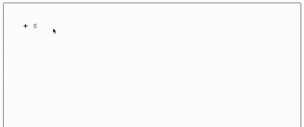

# SmartLink
Block for [Editor.js](https://editorjs.io/) to create a smart block using a pasted link.




## Full customization

You can customize the block by passing a configuration object to the constructor. SmartLink use a handlebars template to render the block. You can pass a custom template to the block by passing a template string to the constructor. 

## Installation

Get the package

```shell
npm i --save https://github.com/jodacame/editorjs-smartlink
```

Include module at your application

```javascript
import SmartLink from '@jodacame/editor-js-smartlink';
```

## Usage

Add a new Tool to the `tools` property of the Editor.js initial config.

```javascript
var editor = EditorJS({
  ...

  tools: {
    ...
    smartlink: {
        class: SmartLink,
        config: {
            endpoint: YOUR_API_ENDPOINT,
            templates: {
                CUSTOM_TYPE: YOUR_HANDLEBARS_TEMPLATE, 
                CUSTOM_TYPE_2: YOUR_HANDLEBARS_TEMPLATE_2,
                ...
            } 
            headers: {
                ...
            }
        }
    }
  },
  ...
});
```

## Config Params

SmartLink supports the following configuration parameters:

| Field | Type     | Description |
| ----- | -------- | ----------- |
| endpoint | `string` | The endpoint to send the request to. You will receive the URL in query parameter `url`. |
| template | `string` | The handlebars template to render the block. |
| headers | `object` | The headers to send with the request. |

## Output data

All output data is under your control. You can customize the output data in your backend. The block will send a request to the endpoint you provide with the URL in the query parameter `url`. You can use this URL to get the data you need to render the block.

Response needs to be a JSON object with the following structure:

```json
{
   "type": "Your custom type, need match with the template",
   ... // Your custom response data to use in the template and render the block

}
```

## Example 

```javascript
var editor = EditorJS({
  ...

  tools: {
    ...
    smartlink: {
        class: SmartLink,
        config: {
            endpoint: 'https://your-api-endpoint.com',
            template: {
                test:'<div class="smartlink"><h2>{data.title}}</h2><p>{{data.description}}</p></div>',
            },
            headers: {
                'Authorization': 'Bearer YOUR_TOKEN'
            }
        }
    }
  },
  ...
});

// Server response
{
    "type": "test",
    "data": {
        "title": "Title",
        "description": "Description",
        "image": "https://image-url.com"
    }
    
}

```

## More...

Keep in mind that all pasted links will be sent to the endpoint you provide. You can use this to get the data you need to render the block.

In your backend, you can detect the URL and return the data you need to render the block. Example:

```javascript

// In your backend
app.get('/smartlink', async (req, res) => {
    const url = req.query.url;
    if (url.startsWith('https://www.themoviedb.org/')) {
        // Get movie data from The Movie Database API
        const movieId = url.split('/').pop();
        const response = axios.get(`https://api.themoviedb.org/3/movie/${movieId}`);
        res.json({
            type: 'movie',
            movie: response.data
        });
    }
});

// In your frontend

  tools: {
    ...
    smartlink: {
        class: SmartLink,
        config: {
            endpoint: 'https://your-api-endpoint.com/smartlink',
            template: {
                movie:`<div class="smartlink">
                            <h2>{{movie.title}}</h2>
                            <p>{{movie.overview}}</p>
                            
                        </div>`,
            },
        }
    }
  }        
   
```

## Explaining the example

In this example, we are sending all pasted links to the endpoint `https://your-api-endpoint.com/smartlink`. In the backend, we are detecting if the URL is from The Movie Database. If it is, we are getting the movie data from The Movie Database API and returning it to the frontend.

In the frontend, we are rendering the block using the handlebars template `movie`. We are using the movie data to render the block. Remember that template names need to match the `type` field in the response and then you can use the data in the handlebars template.

**You can add as many templates as you want to the block. Just add them to the `templates` object in the block configuration.**


## Render saved data in the frontend 
Now you can render the saved data in the frontend, you can reuse the handlebars template you used in the block configuration. All data is under data.metadata. Example:

```javascript
const savedData = [
    {
        type: 'movie',
        data: {
            ...
            metadata: {
                title: 'Movie title',
                overview: 'Movie overview',
                poster_path: '/poster_path.jpg'
            }
        }
    }
];

savedData.forEach(data => {
    const template = Handlebars.compile(templates[data.type]);
    const html = template.render(data.metadata);
    document.body.innerHTML += html;
});
```

## Predefined templates

You can use predefined templates to render the block. Your backend needs to return the data in the following structure to use the predefined templates:

### Embed
Create a iframe block with the URL provided in the backend response.

```json
{
    "type": "embed",
    "embed": {
        "url": "https://www.youtube.com/embed/VIDEO_ID",
        "caption": "Video caption"
    }
}

```


### Audio
Create an audio block with the URL provided in the backend response.

```json
{
    "type": "audio",
    "audio": {
        "url": "https://audio-url.com",
        "caption": "Audio caption"
    }
}
```

### Link (Opengraph)
Create a link block with the URL provided in the backend response. The block will render the title, description, and image of the URL.

```json
{
    "type": "link",
    "meta": {
        "url": "https://link-url.com",
        "title": "Link title",
        "description": "Link description",
        "image": "https://image-url.com",
        "hostname": "link-url.com"
    }
}
```

### Movie 
Create a movie block with the movie data provided in the backend response. This template use a themoviedb.org movie data object.

```json
{
    "type": "movie",
    "movie": {
        ...Movie data object from The Movie Database API
    }
}
```


   
